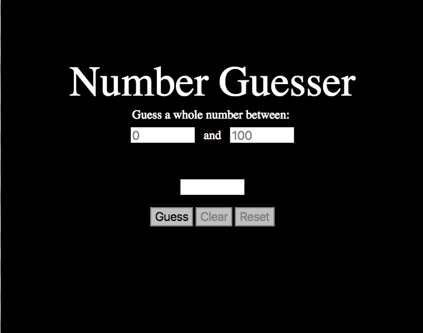

## Number Guesser

A game written in JavaScript where the user sets a minimum and maximum, a random number is automatically generated, and the user tries to guess the random number given clues upon each guess. Once the game is won, the application automatically increases and decreases the minimum and maximum by 10.

